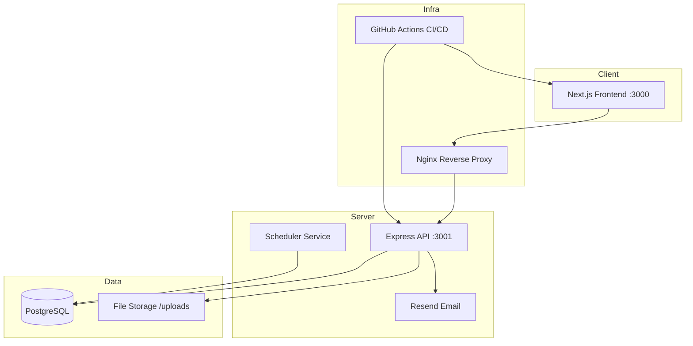
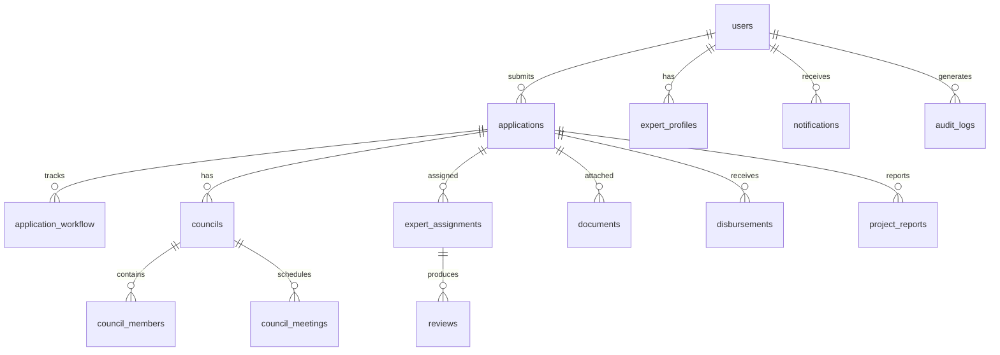

# BMAD Architecture — NATIF OMS v2.0

## Architecture Decision Records

### ADR-01: Keep Express + PostgreSQL

- Status: Accepted.
- Context: Existing backend is Express + pg. Rewriting to NestJS or similar adds risk without clear benefit for this scope.
- Decision: Keep Express, add typed route handlers, shared error middleware, and API response envelope.
- Consequence: Lower migration risk, faster delivery.

### ADR-02: Typed API Client on Frontend

- Status: Proposed.
- Context: Frontend uses raw fetch/authFetch with inline URL construction. Leads to duplication and type drift.
- Decision: Create `frontend/lib/api.ts` with typed functions per resource. Use Zod schemas shared with backend validators.
- Consequence: Single source of truth for API contracts.

### ADR-03: Add Disbursement and Project Report Tables

- Status: Proposed.
- Context: Reports module queries `disbursements` and `project_reports` tables that may not exist yet.
- Decision: Add migration 009 for disbursements and project_reports tables. Add CRUD routes.
- Consequence: Completes post-approval lifecycle.

### ADR-04: Audit Log Table

- Status: Proposed.
- Context: No audit trail for user actions beyond workflow history.
- Decision: Add `audit_logs` table. Middleware logs all mutating requests.
- Consequence: Compliance, debugging, accountability.

### ADR-05: Shared DashboardShell + Role Page Pattern

- Status: Accepted (partially implemented).
- Context: clerk, officer, dept_head, director pages already use DashboardShell. Admin page does not.
- Decision: Migrate admin page to DashboardShell. Extract shared ApplicationTable component.
- Consequence: Consistent UX, less code duplication.

### ADR-06: JWT in httpOnly Cookie

- Status: Proposed.
- Context: Current localStorage JWT is vulnerable to XSS.
- Decision: Move JWT to httpOnly secure cookie. Keep Authorization header as fallback for API-only clients.
- Consequence: Better security posture. Requires CORS/cookie config changes.

## System Architecture

## Database Schema Overview

## New Tables Required

### disbursements

| Column | Type | Notes |
|--------|------|-------|
| id | UUID PK | |
| application_id | UUID FK | |
| amount | NUMERIC | |
| disbursement_date | DATE | |
| notes | TEXT | |
| created_by | UUID FK | |
| created_at | TIMESTAMPTZ | |

### project_reports

| Column | Type | Notes |
|--------|------|-------|
| id | UUID PK | |
| application_id | UUID FK | |
| report_period | VARCHAR | Q1/2025 etc |
| status | VARCHAR | draft, submitted, approved, rejected |
| content | TEXT | |
| financials | JSONB | |
| submitted_at | TIMESTAMPTZ | |
| reviewed_by | UUID FK | |
| reviewed_at | TIMESTAMPTZ | |
| created_at | TIMESTAMPTZ | |

### audit_logs

| Column | Type | Notes |
|--------|------|-------|
| id | UUID PK | |
| user_id | UUID FK | |
| action | VARCHAR | create, update, delete, transition |
| resource_type | VARCHAR | application, user, council, etc |
| resource_id | UUID | |
| details | JSONB | |
| ip_address | INET | |
| created_at | TIMESTAMPTZ | |

## API Conventions

- All responses: `{ data, pagination?, error? }`.
- Error format: `{ error: string, code?: string, details?: object }`.
- Auth: Bearer token in header OR httpOnly cookie.
- Pagination: `?page=1&limit=20` → response includes `pagination: { total, page, limit, pages }`.

## Frontend Architecture

- Shared: DashboardShell, ApplicationTable, StatusBadge, WorkflowTimeline.
- Per-role pages use DashboardShell + role-specific action panels.
- API client: `frontend/lib/api.ts` with typed functions.
- State: Zustand for auth, React state for page-local data.
- Forms: react-hook-form + zod validation.
