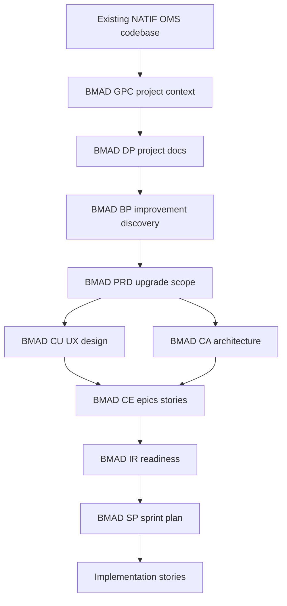

# BMAD Plan — NATIF OMS Upgrade

## Context

- Product: oms.natif.vn — NATIF Online Manager System.
- Codebase: Next.js frontend, Express backend, PostgreSQL DB.
- BMAD workspace: `/home/ubuntu/bmad_workspace`.
- Project workspace: `/home/ubuntu/Natif-Online-Manager-System`.
- BMAD version: 6.7.1.
- BMAD modules: core, bmm.

## Recommended BMAD Flow

1. GPC — Generate Project Context for existing codebase.
2. DP — Document Project from code and current docs.
3. BP — Brainstorm improvements and problem areas.
4. PRD — Create upgrade PRD for oms.natif.vn.
5. CU — Create UX design for role dashboards and application workflows.
6. CA — Create brownfield upgrade architecture.
7. CE — Create epics and stories.
8. IR — Check implementation readiness.
9. SP — Sprint planning.
10. CS/DS/CR — Story implementation cycle.

## Initial Findings

### Implemented

- Auth: register, login, forgot/reset password, verify email.
- Role model: admin, moderator, enterprise, expert, officer, dept_head, director, clerk.
- Workflow engine: draft to approved with branch states.
- Enterprise application form.
- Role dashboards.
- Expert profile and assignments.
- Councils and meetings.
- Notifications and Resend email service.
- News CMS.
- Reports and Excel export.
- Document uploads.
- Docker deployment assets.

### Likely Upgrade Targets

- Align frontend legacy admin status labels with new workflow states.
- Replace ad-hoc dashboard pages with shared components and typed API client.
- Add missing financial/project lifecycle modules: disbursements, project reports, monitoring.
- Strengthen RBAC and route permissions.
- Improve production readiness: migrations, seeds, backups, observability.
- Add automated tests across workflow transitions and role dashboards.
- Improve UX: review modals, timeline details, action confirmations, empty/error/loading states.

## Mermaid Overview

## Next Required Decision

Choose how to connect BMAD to this codebase:

- Option A: Keep BMAD workspace separate and write outputs into `/home/ubuntu/bmad_workspace/_bmad-output`, referencing NATIF code path.
- Option B: Install/copy BMAD into this project so outputs live inside `Natif-Online-Manager-System`.
- Option C: Use current Architect mode to produce BMAD-equivalent artifacts directly in `plans/`, then switch to Orchestrator/Code.

## Proposed Default

Use Option C immediately for speed, then Option A/B later if CLI integration is required.
