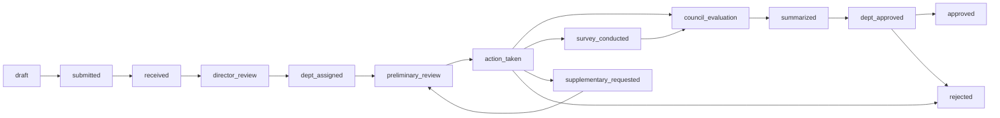

# BMAD GPC — NATIF OMS Project Context

## System

NATIF Online Manager System is a brownfield public-sector funding workflow platform for oms.natif.vn. It supports enterprise application intake, internal multi-role review, expert/council evaluation, notifications, CMS content, and reporting.

## Stack

- Frontend: Next.js 14, React 18, TypeScript, Tailwind CSS, shadcn-style components.
- Backend: Node.js, Express, TypeScript, PostgreSQL, Knex/node-pg-migrate style migrations.
- Auth: JWT stored client-side via localStorage.
- Email: Resend API.
- Deployment: Docker Compose, Nginx, GitHub Actions/VPS scripts.

## Key Files

- Backend entry: `backend/src/server.ts`.
- Backend routes: `backend/src/routes/*`.
- Backend middleware: `backend/src/middleware/auth.ts`, `backend/src/middleware/rateLimiter.ts`, `backend/src/middleware/validate.ts`.
- Backend DB config: `backend/src/config/database.ts`.
- Migrations: `backend/migrations/*`.
- Frontend entry: `frontend/app/page.tsx`.
- Frontend role pages: `frontend/app/admin/page.tsx`, `frontend/app/clerk/page.tsx`, `frontend/app/officer/page.tsx`, `frontend/app/dept-head/page.tsx`, `frontend/app/director/page.tsx`, `frontend/app/expert/page.tsx`, `frontend/app/apply/dashboard/page.tsx`.
- Shared frontend: `frontend/components/DashboardShell.tsx`, `frontend/lib/auth.ts`, `frontend/lib/dashboard.ts`.

## Roles

- admin: full management.
- enterprise: apply, track, supplement documents.
- clerk: receive and forward applications.
- director: assign department, decide scenario, final approve/reject.
- dept_head: assign officer, approve department summary, manage councils.
- officer: preliminary review, propose scenario, synthesize results.
- expert: expert profile, assignments, reviews.
- moderator: content/news support.

## Core Workflow

## Existing Capabilities

- Authentication and account recovery.
- Enterprise application form.
- Role-based application lists/actions.
- Workflow transition engine with notifications.
- Expert profile and review assignments.
- Council, members, meetings.
- News CMS, categories, menus.
- Document checklist/upload/download/review.
- Notifications and email.
- Reports/IOOI and Excel export.
- Docker deployment assets.

## Current Risks/Gaps

1. Frontend admin page still has legacy statuses like `reviewing`; may conflict with redesigned workflow.
2. Role dashboards duplicate table/modal/action logic.
3. API calling is ad-hoc; no typed API client or normalized error handling.
4. Project lifecycle after approval is incomplete: disbursements, monitoring, project reports, outcomes.
5. Reports query tables such as disbursements/project_reports; need migration verification.
6. RBAC is route-level but needs audit of object-level permissions.
7. Client-side JWT localStorage has security tradeoffs.
8. Tests exist but coverage likely limited.
9. Production ops need backup, monitoring, migration process, seed/admin bootstrap.

## Upgrade Direction

Upgrade oms.natif.vn from a functional MVP to a production-grade public-sector workflow system:

- Standardize workflow UX across roles.
- Add post-approval financial/project lifecycle.
- Harden security, audit, and operations.
- Improve maintainability with typed contracts and reusable UI.
- Add tests and readiness gates before production rollout.
