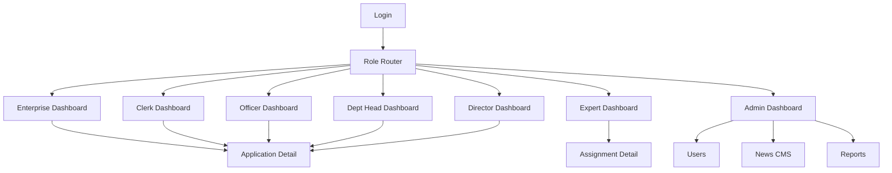
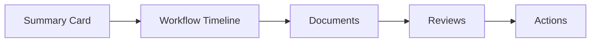

# BMAD UX Design — NATIF OMS v2.0

## UX Goals

- Giảm rối cho 8 role bằng layout nhất quán.
- Hiển thị rõ trạng thái hồ sơ, người đang xử lý, hành động tiếp theo.
- Tối ưu xử lý nghiệp vụ trên dashboard, hạn chế chuyển trang không cần thiết.
- Mobile usable cho theo dõi và phê duyệt nhanh.

## Information Architecture

## Shared Screen Pattern

### Dashboard Page

- Sidebar: role nav, home link, user role badge.
- Header: page title, notification bell, user menu.
- Stats strip: key counts by status.
- Filter/search row: status, program type, keyword.
- Main list: ApplicationTable.
- Detail panel/modal: application overview + workflow + documents + comments + actions.

## Application Detail Layout

### Sections

1. Summary: title, enterprise, program, budget, submitted date.
2. Workflow: current status, history, next action.
3. Documents: checklist status, uploads, review result.
4. Reviews: expert/council/officer notes.
5. Actions: role-specific transition buttons.

## Role-Specific UX

### Enterprise

- Primary CTA: Nộp hồ sơ mới.
- Alerts: hồ sơ cần bổ sung.
- Timeline simple and readable.
- Detail action: bổ sung tài liệu, gửi báo cáo tiến độ.

### Clerk

- Focus: tiếp nhận nhanh.
- Batch actions later, single action now.
- Tabs: Đã nộp, Đã tiếp nhận, Đã giao lãnh đạo.

### Officer

- Focus: hồ sơ được giao.
- Action panel: đề xuất phương án, tổng hợp hội đồng.
- Show proposal notes and prior decision context.

### Dept Head

- Focus: phân công chuyên viên, lập hội đồng, duyệt tổng hợp.
- Action panel includes officer selector and council controls.

### Director

- Focus: phân phòng, quyết định phương án, duyệt cuối.
- Highlight decision risks and pending summaries.

### Expert

- Focus: assignments and profile completeness.
- Assignment detail: scores, recommendation, comments.

### Admin

- Unified shell.
- Navigation: Dashboard, Users, News, Reports, Menu, Settings.
- Replace legacy statuses with full workflow states.

## Component Backlog

- ApplicationTable.
- ApplicationDetailModal.
- WorkflowTimelinePro.
- RoleActionPanel.
- EmptyState.
- ErrorState.
- TableSkeleton.
- MobileCardList.
- NotificationBell enhanced.

## UX Acceptance Criteria

- All role dashboards use one layout system.
- No raw alert for business-critical action failures.
- Each application row exposes one obvious primary action.
- Mobile width 375px supports list, filters, detail, and actions.
- Empty/loading/error states are designed, not plain text.
